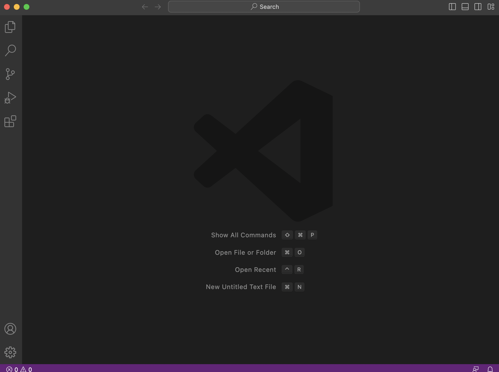

# Lab Report 1
Tutorial on how to log into into a course-specific account on ieng6

## Step 1: Downloading VS code
Click on the following link [VScode](https://code.visualstudio.com/) to download VS code depending on whether your computer runs Windows or Mac.
When you first open VS code, this is what should appear...

or

