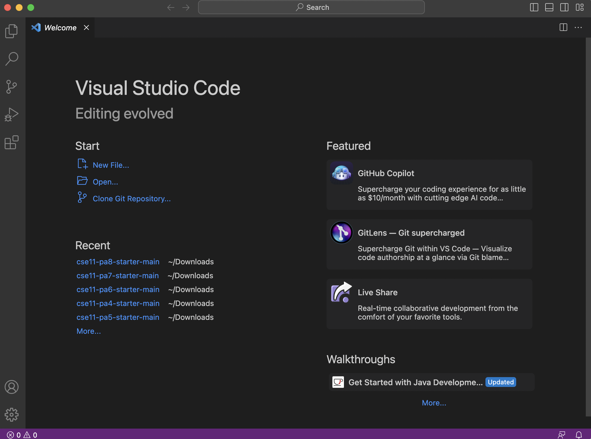
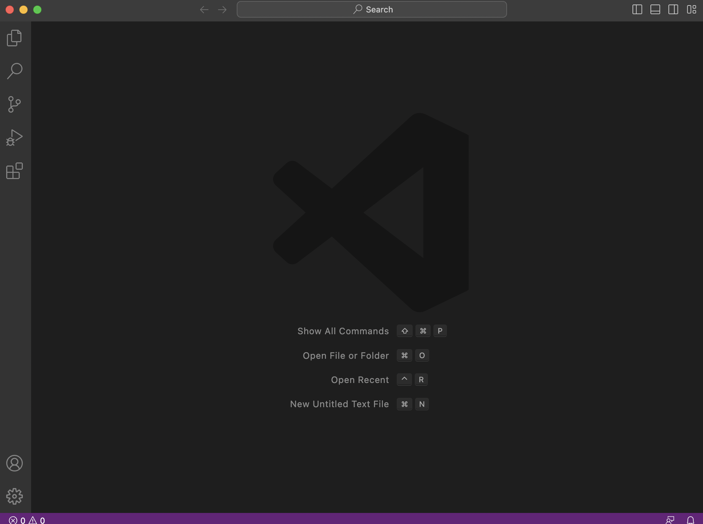
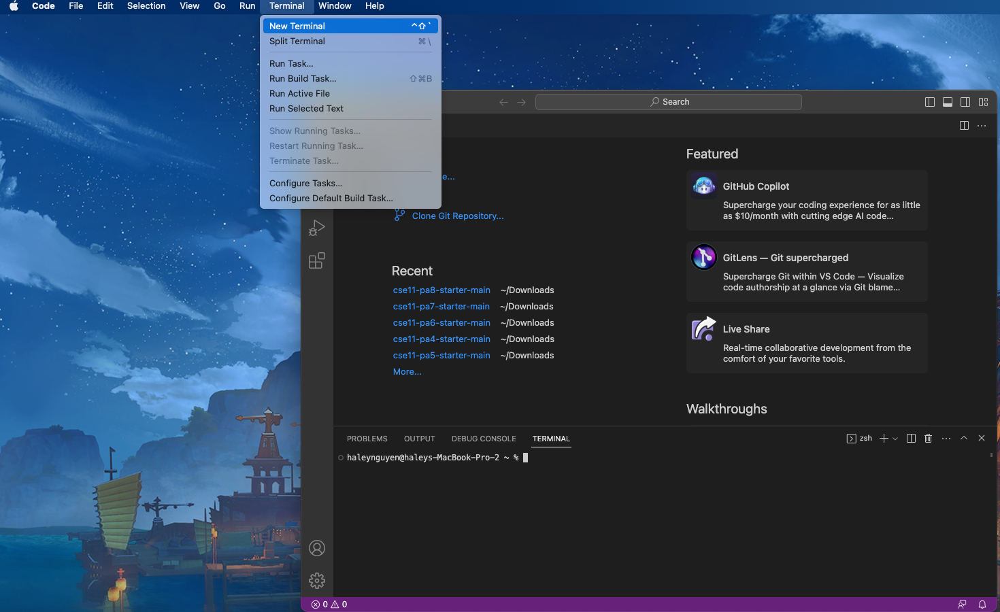
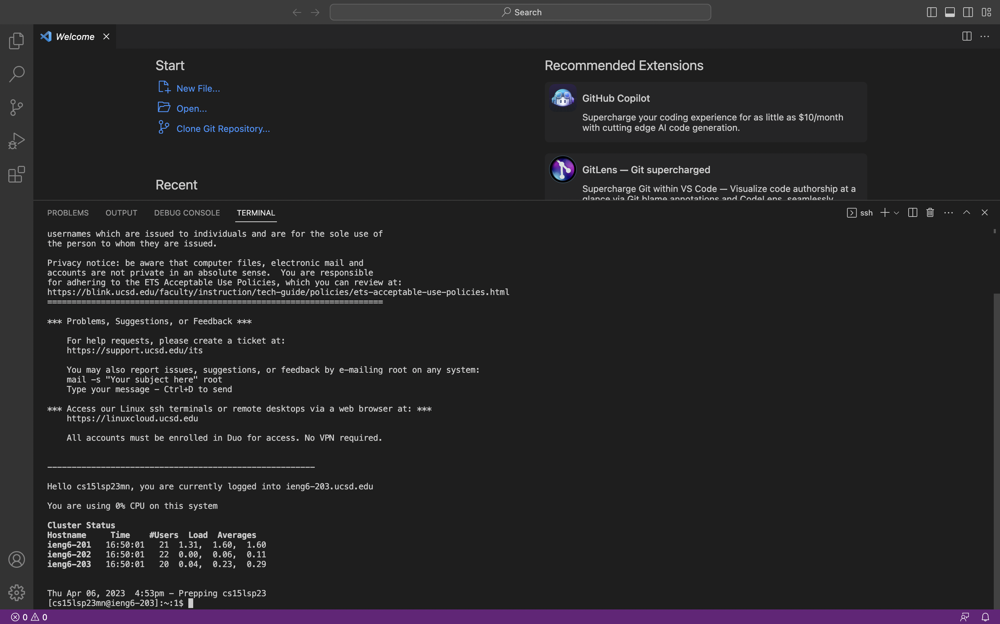
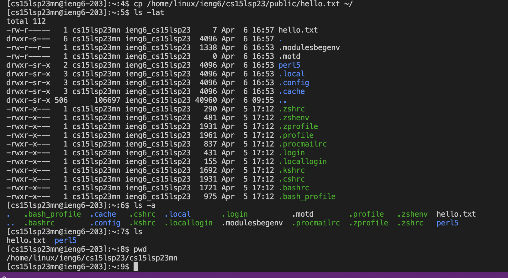

# Lab Report 1
Tutorial on how to log into into a course-specific account on ieng6

## Step 1: Downloading VS code
Click on the following link [VScode](https://code.visualstudio.com/) to download VS code depending on whether your computer runs Windows or macOS.
When you first open VS code, this is what should appear

or

I'm using a Macbook to do this, and one of the two welcome pages should appear when you open VS code

## Step 2: Remotely Connecting
Since my computer runs macOS, I did not need to download git (it is aleady installed :))
You will have to do the following, however, to connect to the remote server

1. Open up a terminal in VS code

2. To use ssh, type *(ssh cs15lsp23zz@ieng6.ucsd.edu)* into the terminal, and replace *zz* with the letters in your course-specific account (in my case it is mn)

- You should be prompted with this in the terminal
> The authenticity of host 'ieng6.ucsd.edu (128.54.70.227)' can't be established.
RSA key fingerprint is SHA256:ksruYwhnYH+sySHnHAtLUHngrPEyZTDl/1x99wUQcec.
Are you sure you want to continue connecting (yes/no/[fingerprint])? 

3. Type *yes* into your terminal, and then it will ask you for your password

4. If you haven't created a passcode yet, click on this link https://sdacs.ucsd.edu/~icc/index.php to create one, and the following link is a tutorial on how to do it https://drive.google.com/file/d/17IDZn8Qq7Q0RkYMxdiIR0o6HJ3B5YqSW/view?usp=share_link
- Remember to click on your cs15l account and not any other one you might have

5. After typing in your password, this is what your terminal should look like
- Keep in mind, when you type your password it won't show up in the terminal due to security reasons, but your typing will still be registered

## Step 3: Trying out some commands 
Try running some of the following commands in the terminal:
- cp /home/linux/ieng6/cs15lsp23/public/hello.txt ~/
- ls -lat
- ls -a
- ls
- pwd

This is what the commands printed out for me

the ls command printed lists while the pwd command printed out the current working directory I was in
 
 > You should run the commands on your computer (without ssh-ing) and with (ssh-ing)
 > - To exit the server that you connected to by (ssh-ing) simply do Ctrl-D to exit
