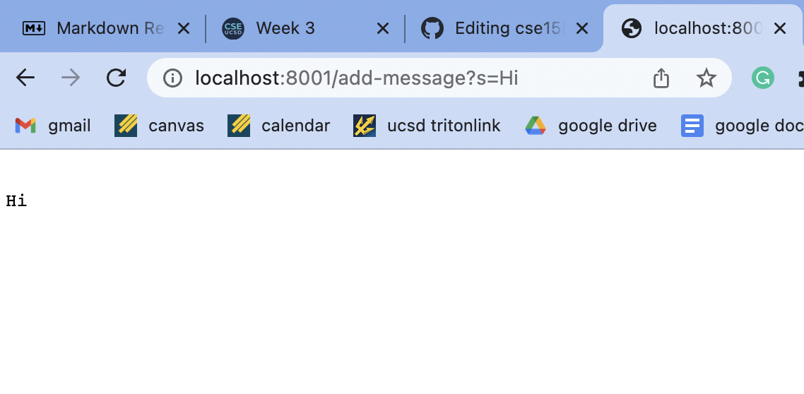
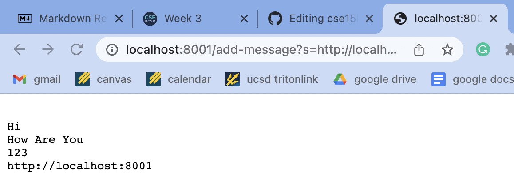
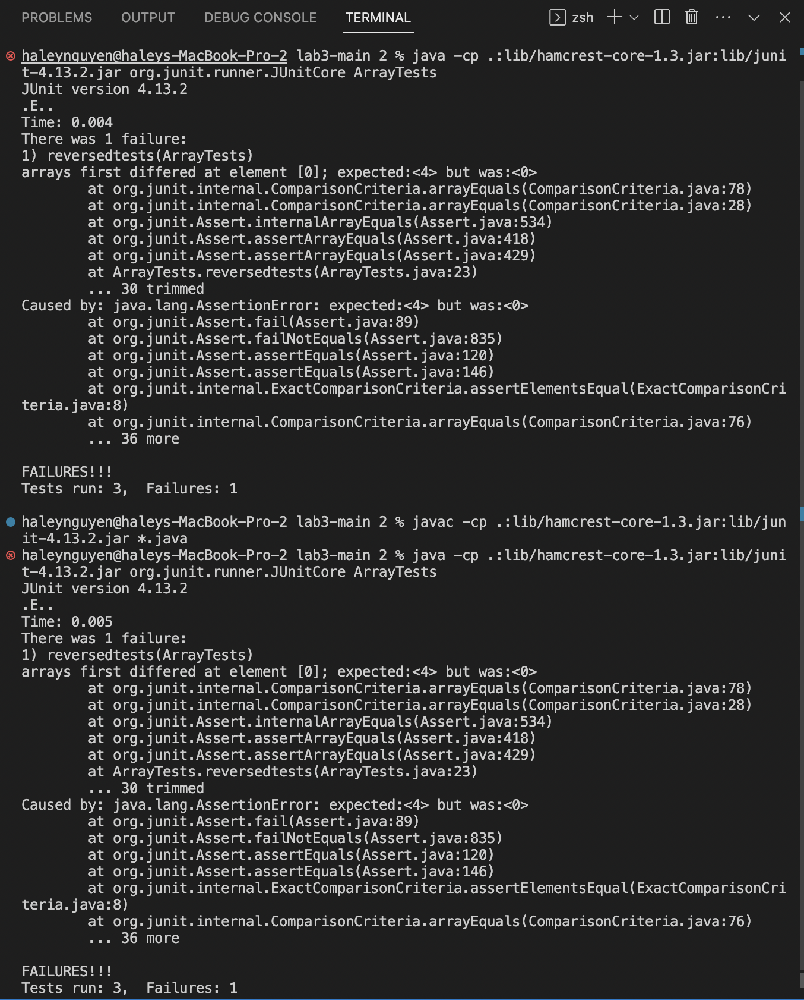

# Lab Report 2

## Part 1 - creating a web server

StringServer.java code:
```
import java.io.IOException;
import java.net.URI;

class Handler implements URLHandler {
    // The one bit of state on the server: a number that will be manipulated by
    // various requests.
    String s = "";

    public String handleRequest(URI url) {
        if(url.getPath().equals("/")) {
            return s;
        }
       else if(url.getPath().contains("/add-message")){
            String[] parameters = url.getQuery().split("=");
            if(parameters[0].equals("s")){
                s = s.concat("\n" + parameters[1]);
                return String.format(s);
            }
        }
        return "404 Not Found";
    }
}

class StringServer {
    public static void main(String[] args) throws IOException {
        if(args.length == 0){
            System.out.println("Missing port number! Try any number between 1024 to 49151");
            return;
        }
        int port = Integer.parseInt(args[0]);
        Server.start(port, new Handler());
    }
}
```

Using `/add-message`:


The handleRequest(URI url) method is being called here to decide what the server will print out based on what is typed in its url. The relevent argument here is the path that one would type -- in my case, I typed `/add-message?s=Hi`. The releveant fields include `String s` which is a single string keeping track of all the values being typed into the url, and `String[] parameters` which splits the queries after the equal sign up into elements to fit into an array. Since this image depicts my first search in the server, the only change that happened is that the value "Hi" got added to `s`.



The handleRequest(URI url) method is being called here to decide what the server will print out based on what is typed in its url. The relevent argument here is the path that one would type -- in my case, I typed `/add-message?s=http://localhost:8001`. The releveant fields include `String s` which is a single string keeping track of all the values being typed into the url, and `String[] parameters` which splits the queries after the equal sign up into elements to fit into an array. Since this image depicts my fourth search in the server, a change that took place is that the value "http"//localhost:8001" got added to `s` and is printed out on a new line.

## Part 2 - working with bugs

Failure inducing input for the buggy program:
```
 @Test
  public void reversedtests(){
    int[] input = {1,2,3,4};
    int[] reversed = {4,3,2,1};
    assertArrayEquals(reversed, ArrayExamples.reversed(input));
  }
  ```  
  
An input that doesn't induce a failure:
```
@Test
  public void testReversed() {
    int[] input1 = { };
    assertArrayEquals(new int[]{ }, ArrayExamples.reversed(input1));
  }
```

The symptom of running the above tests:


Code with bugs:
```
static int[] reversed(int[] arr) {
    int[] newArray = new int[arr.length];
    for(int i = 0; i < arr.length; i += 1) {
      arr[i] = newArray[arr.length - i - 1];
    }
    return arr;
  }
```

Fixed code (no bugs):
```
static int[] reversed(int[] arr) {
    int[] newArray = new int[arr.length];
    for(int i = 0; i < arr.length; i += 1) {
      newArray[i] = arr[arr.length - i - 1];
    }
    return newArray;
  }
```
The original code which has `arr[i] = newArray[arr.length - i - 1]` had to be changed to `newArray[i] = arr[arr.length - i - 1]` so that the new array was getting its values updated rather than the inputted one. Not only that, but the return statement had to return `newArray` and not `arr` so that it would return the newly created array rather than the inputted one.

# Part 3 - learning something new
During the week 2 lab I learned how to build and run a server. 
Using the commands `⤇ javac Server.java NumberServer.java` to build it and `⤇ java NumberServer 4000` to run it, I was outputted `Server Started! Visit http://localhost:4000`. I learned that the "4000" in the url refers to a speciifc port that the server runs on and that "localhost" refers to the computer I am on. 
