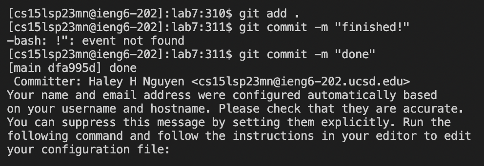

# Lab Report 4

## Using vim in VsCode

### Step 4: Logging into ieng6
**Keys pressed**: `ssh cs15lsp23mn@ieng6.ucsd.edu`, `<enter>`  

After following the steps in the lab, I was able to log into my ieng6 account without the use of a password. All I had to type was `ssh cs15lsp23mn@ieng6.ucsd.edu`.

## Step 5: Clone your fork of the repository from your Github account
**Keys pressed**: `git clone`, `Command-C`, `Command-V`, `<enter>`, `cd`, `lab7`, `<enter>`  

After typing out `git clone` I used `Command-C` and `Command-V` to copy and paste the url (`https://github.com/nguyenhaley/lab7.git`) to the forked repository into my terminal. 
I then used `cd` so that I could change my current directory into lab7 so that I could access ListExamples.java later on.

## Step 6: Run the tests, demonstrating that they fail
**Keys pressed**: `Command-C`, `Command-V`,  `<enter>`, `Command-C`, `Command-V`, `<backspace>`, `<backspace>`, `<backspace>`, `ListExamplesTests`, `<enter>`  

I used `Command-C` and `Command-V` twice to copy and paste the javac and the java command in order to compile and run the code.  
The javac command was `javac -cp .:lib/hamcrest-core-1.3.jar:lib/junit-4.13.2.jar *.java`  
The java command was `java -cp .:lib/hamcrest-core-1.3.jar:lib/junit-4.13.2.jar org.junit.runner.JUnitCore ... ` and I changed the `...` to `ListExamplesTests`

## Step 7: Edit the code file to fix the failing test
**Keys pressed**: `vim ListExamples.java`, `<enter>`, `:44`, `<enter>`, `e` , `x`, `i`, `2`, `<esc>`, `:wq`  

I had to type `vim ListExamples.java` and then `<enter>`in order to access vim
  
  
I used the command`:44` and `<enter>` to move my cursor to the beginning of the 44th line which was the line that needed to be edited
  
  
I typed `e` to move my cursor to the end of the first word which was index1
  
  
I typed `x` to delete the 1 in index1
  
  
I typed `i` to enter insert mode and `2` to insert a 2 after index
  
  
After all of this, I typed `<esc>` to exit insert mode and enter normal mode again and `wq:` + `<enter>`to save and quit vim

## Step 8: Run the tests, demonstrating that they now succeed
**Keys pressed**: `<up>`, `<up>`, `<up>`, `<enter>`, `<up>`, `<up>`, `<up>`, `<enter>`  

I used the keys above to access `javac -cp .:lib/hamcrest-core-1.3.jar:lib/junit-4.13.2.jar *.java` to compile the tests.
I used the same keys above to access `java -cp .:lib/hamcrest-core-1.3.jar:lib/junit-4.13.2.jar org.junit.runner.JUnitCore ListExamplesTests` to 
run the tests.

## Step 9: Commit and push the resulting change to your Github account 
**Keys pressed**: `git add .`, `git commit -m "finished"`, `git push git@github.com:nguyenhaley/lab7.git main`, `<enter>`  

To commit: I first added the files I edited using `git add .`. I then used the command `git commit -m` along with my message "done" to 
the end of my commit line.
  

To push: To push the change to my Github account, I used the `git push` command followed by my ssh key `git@github.com:nguyenhaley/lab7.git` and `main`  

