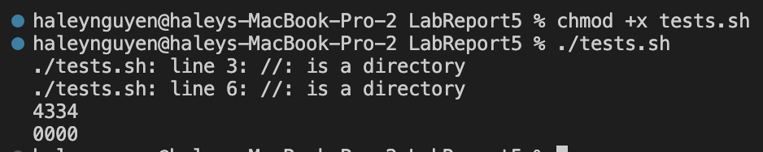
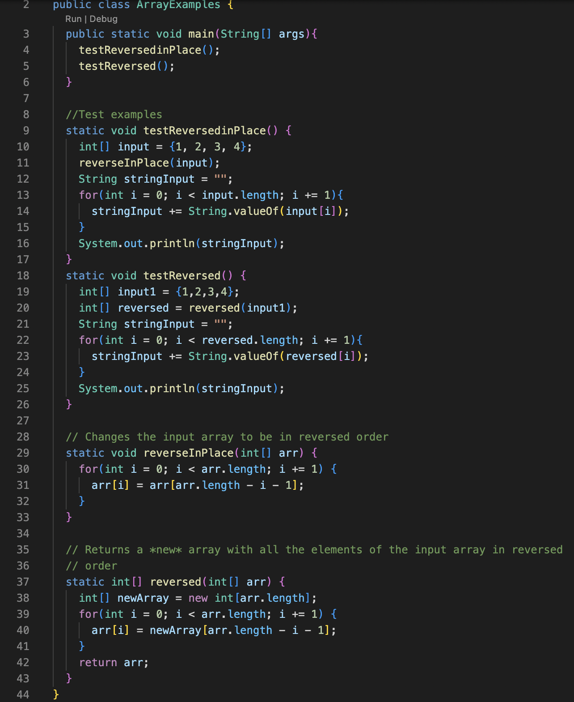
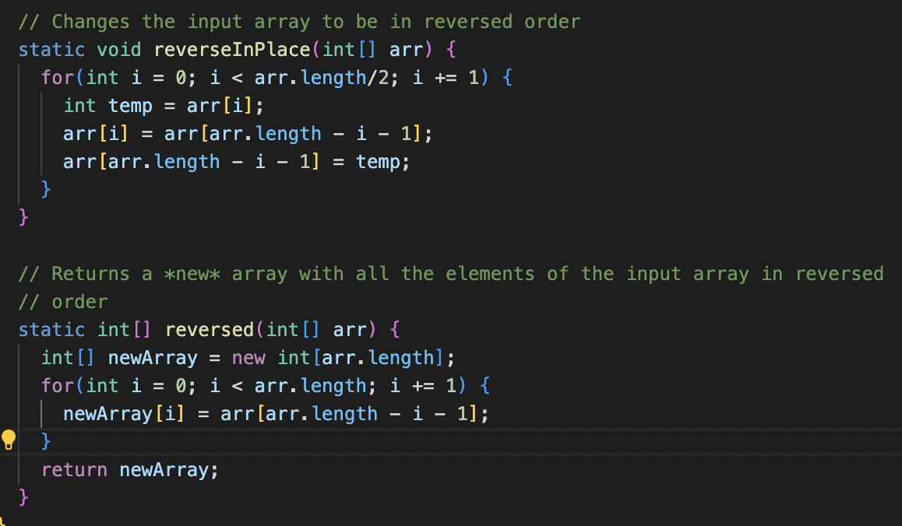
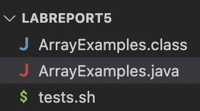
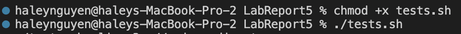

# Lab Report 5

## Part 1: Debugging Scenario
### 1. Original post
**Title:** <br>
Help with reversing lists

**What environment are you using (computer, operating system, web browser, terminal/editor, and so on)?** <br>
I am currently running my code on a MacBook Pro which means I am using my Mac's operating system. I am using the VSCode terminal and editor in order to compile and run my code. I have the LABREPORT5 directory open which contains the files ArrayExamples.java and tests.sh. <br>

**Detail the symptom you're seeing. Be specific; include both what you're seeing and what you expected to see instead. Screenshots are great, copy-pasted terminal output is also great. Avoid saying “it doesn't work”.** <br>
I am trying to run some reverse methods in my ArrayExamples.java through bash, but it's not giving me the ouput that I want (the given array in reversed order). Instead, its printing out repeated elements in the original array instead of "4321" and has some weird behavior which I can't seem to decipher. <br>
 <br>

**Detail the failure-inducing input and context. That might mean any or all of the command you're running, a test case, command-line arguments, working directory, even the last few commands you ran. Do your best to provide as much context as you can.** <br>
I believe that the problem here doesn't deal with my bash file but rather the java file I created. My tests are able to run, however, the output is not what I want. Attatched to this post is a screenshot of the methods I am trying to test out. <br>
 <br>

## 2. TA Response
You're correct in your observation that there is a bug inside your reverse methods and not your bash script! For your `reverseInPlace` method, consider how many times you want your loop to iterate and think about what happens if you aren't creating a new array to store the reversed elements. For your `reversed` method, consider what values you want to be stored in your `newArray` and your original array `arr`.

## 3. Updated code after TA Response

I realized that in my `reverseInPlace` method, I had to change `i < arr.length` to `i < arr.length/2` to correctly traverse through and reverse the array. I also created a new variable `temp` to store the value of `arr[i]` so that when I changed the value at `arr[i]`, the old value wouldn't be forgotten. For my `reversed` method, I had to assign values to `newArray` instead of `arr` so I swapped the two in the assignment statement and returned `newArray` instead of `arr`.

## 4. All of the necessary setup information
**The file and directory structure:** <br>
* LABREPORT5
  * ArrayExamples.java
  * tests.sh <br>

 <br>
I had a folder named `LABREPORT5` with two files in it. One of the files was a java file named `ArrayExamples.java` and the other was a bash file named `tests.sh`.

**Contents of file before fixing the bug:** <br>
For `ArrayExamples.java`:
```
public class ArrayExamples {
  public static void main(String[] args){
    testReversedinPlace();
    testReversed();
  }
  
  //Test examples
  static void testReversedinPlace() {
    int[] input = {1, 2, 3, 4};
    reverseInPlace(input);
    String stringInput = "";
    for(int i = 0; i < input.length; i += 1){
      stringInput += String.valueOf(input[i]);
    }
    System.out.println(stringInput);
  }
  static void testReversed() {
    int[] input1 = {1,2,3,4};
    int[] reversed = reversed(input1);
    String stringInput = "";
    for(int i = 0; i < reversed.length; i += 1){
      stringInput += String.valueOf(reversed[i]);
    }
    System.out.println(stringInput);
  }
  
  // Changes the input array to be in reversed order
  static void reverseInPlace(int[] arr) {
    for(int i = 0; i < arr.length/2; i += 1) {
      int temp = arr[i];
      arr[i] = arr[arr.length - i - 1];
      arr[arr.length - i - 1] = temp; 
    } 
  }

  // Returns a *new* array with all the elements of the input array in reversed
  // order
  static int[] reversed(int[] arr) {
    int[] newArray = new int[arr.length];
    for(int i = 0; i < arr.length; i += 1) {
      newArray[i] = arr[arr.length - i - 1];
    }
    return newArray;
  }
}
```

For `tests.sh`:
```
#!/bin/bash

// compile code
javac ArrayExamples.java

// run code
java ArrayExamples
```

**Command(s) used to trigger the bug:**
The commands run to reveal the possibility of bugs in `ArrayExamples.java`:


**What to edit to fix the bug:** <br>
**reverseInPlace:** For this method, you had to change how many times the loop would iterate to `i < arr.length/2` compared to the original `i < arr.length` so that every element in array is checked only once and not more than that. You also had to create a new variable `temp` to store `arr[i]` to save the value at `arr[i]` before it got changed so that you could access it in the future. <br>

**reversed:** For this method, you had to change the value assignment to `newArray[i] = arr[arr.length-i-1]` compared to the original `arr[i] = newArray[arr.length - i - 1]` so that you assign the reversed elements to newArray rather than the original one. Also, you have to return `newArray` and not `arr` at the end.


## Part 2: Reflection
Something I learned this quarter is that if I ever need help with something, I need to be the one to take intitiative to ask. I realized that a lot of the people in my lab were quick to understand what was going on and worked at their own fast-pace (something that was difficult for me to do), so if I ever needed assistance I had to go ask them for help rather than have them check up on everybody else. Not only that, but learning how to write a grading script was also very interesting because it let me take a peek into what TA's usually do for us that I had never seen before. 
